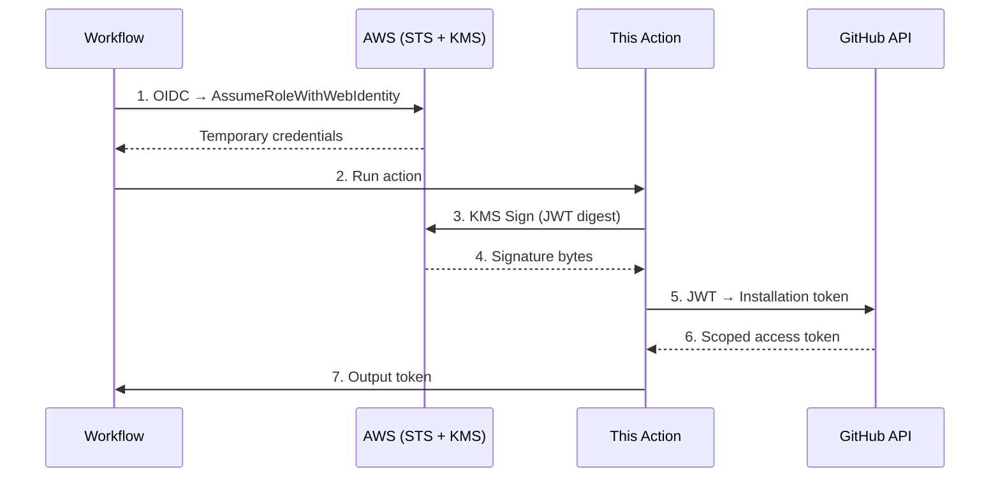

# Create GitHub App Token (AWS KMS)

[](https://github.com/konippi/create-github-app-token-aws-kms/actions/workflows/ci.yml)
[](https://opensource.org/licenses/MIT)

GitHub Action for creating a GitHub App installation access token using AWS KMS for JWT signing.

The private key never leaves the KMS HSM boundary — JWT signing is delegated to the KMS `Sign` API, eliminating the need to store private keys in GitHub Secrets. This follows [GitHub's official recommendation](https://docs.github.com/en/apps/creating-github-apps/authenticating-with-a-github-app/managing-private-keys-for-github-apps#storing-private-keys) to store private keys in a key management service and use runtime signing.

## Why

Storing GitHub App private keys in GitHub Secrets exposes them to exfiltration via workflow modification, compromised third-party Actions, or process memory scraping. Recent supply chain attacks ([trivy-action](https://www.crowdstrike.com/en-us/blog/from-scanner-to-stealer-inside-the-trivy-action-supply-chain-compromise/), [tj-actions/changed-files](https://www.stepsecurity.io/blog/github-actions-supply-chain-attack-tj-actions-changed-files), [axios](https://socket.dev/blog/axios-npm-package-compromised)) have demonstrated this risk at scale.

This Action addresses the problem structurally: the private key exists only inside AWS KMS, and workflows can only request signatures — never access the key material itself.

## How it works



## Usage

> [!IMPORTANT]
> This action requires **at least one `permission-*` input**. Unlike `actions/create-github-app-token`, permissions are not optional — this enforces least-privilege by design.

### Basic usage (current repository)

```yaml
permissions:
  id-token: write
  contents: read

steps:
  - uses: aws-actions/configure-aws-credentials@e3dd6a429d7300a6a4c196c26e071d42e0343502 # v4
    with:
      role-to-assume: arn:aws:iam::123456789012:role/github-app-token-signer
      aws-region: ap-northeast-1
      role-duration-seconds: 900 # Minimum 15 min — this action only needs KMS for a few seconds

  - uses: konippi/create-github-app-token-aws-kms@main # TODO: pin to commit SHA after first release
    id: app-token
    with:
      app-id: ${{ vars.APP_ID }}
      kms-key-id: ${{ vars.KMS_KEY_ID }}
      permission-contents: read

  - uses: actions/checkout@v6
    with:
      token: ${{ steps.app-token.outputs.token }}
```

### Token for specific repositories

```yaml
  - uses: konippi/create-github-app-token-aws-kms@main
    id: app-token
    with:
      app-id: ${{ vars.APP_ID }}
      kms-key-id: ${{ vars.KMS_KEY_ID }}
      owner: my-org
      repositories: |
        repo-a
        repo-b
      permission-contents: read
      permission-pull-requests: write
```

### Token for all repositories in an organization

```yaml
  - uses: konippi/create-github-app-token-aws-kms@main
    id: app-token
    with:
      app-id: ${{ vars.APP_ID }}
      kms-key-id: ${{ vars.KMS_KEY_ID }}
      owner: my-org
      permission-contents: read
```

## Inputs

| Input | Required | Description |
|-------|----------|-------------|
| `app-id` | Yes | GitHub App ID |
| `kms-key-id` | Yes | AWS KMS key ID, key ARN, alias name (`alias/...`), or alias ARN |
| `owner` | No | GitHub App installation owner. Defaults to current repository owner |
| `repositories` | No | Comma or newline-separated list of repositories. Defaults to current repository |
| `permission-*` | **At least one** | Permission scoping (e.g., `permission-contents: read`). See [Permissions](#permissions) |
| `skip-token-revoke` | No | If `true`, the token will not be revoked when the job completes. Default: `false` |
| `github-api-url` | No | GitHub REST API URL. Default: `${{ github.api_url }}` |

### Permissions

At least one `permission-<name>` input must be set. Available permissions:

`permission-actions`, `permission-administration`, `permission-checks`, `permission-contents`, `permission-deployments`, `permission-environments`, `permission-issues`, `permission-members`, `permission-metadata`, `permission-packages`, `permission-pages`, `permission-pull-requests`, `permission-repository-hooks`, `permission-secret-scanning-alerts`, `permission-secrets`, `permission-security-events`, `permission-statuses`, `permission-vulnerability-alerts`, `permission-workflows`

Values: `read`, `write`, or `admin` (where applicable).

## Outputs

| Output | Description |
|--------|-------------|
| `token` | GitHub installation access token |
| `installation-id` | GitHub App installation ID |
| `app-slug` | GitHub App slug |

## AWS Setup

This action requires three AWS resources. If you already have an IAM OIDC Provider for GitHub Actions, you only need two.

### 1. IAM OIDC Provider

Skip if you already have one for `token.actions.githubusercontent.com`.

```bash
aws iam create-open-id-connect-provider \
  --url https://token.actions.githubusercontent.com \
  --client-id-list sts.amazonaws.com
```

### 2. KMS Key

Create an RSA 2048 key for signing:

```bash
aws kms create-key \
  --key-spec RSA_2048 \
  --key-usage SIGN_VERIFY \
  --description "GitHub App JWT signing key"
```

Import your GitHub App private key into this KMS key. See [AWS docs on importing key material](https://docs.aws.amazon.com/kms/latest/developerguide/importing-keys.html).

Attach a key policy that allows only `kms:Sign` with the specific algorithm:

```json
{
  "Version": "2012-10-17",
  "Statement": [
    {
      "Sid": "AllowSignOnly",
      "Effect": "Allow",
      "Principal": {
        "AWS": "arn:aws:iam::123456789012:role/github-app-token-signer"
      },
      "Action": "kms:Sign",
      "Resource": "*",
      "Condition": {
        "StringEquals": {
          "kms:SigningAlgorithm": "RSASSA_PKCS1_V1_5_SHA_256"
        }
      }
    }
  ]
}
```

### 3. IAM Role + Trust Policy

Create an IAM role with a trust policy that uses [provider-specific OIDC claims](https://sjramblings.io/aws-sts-identity-provider-claims-validation/) (available since February 2026):

```json
{
  "Version": "2012-10-17",
  "Statement": [
    {
      "Effect": "Allow",
      "Principal": {
        "Federated": "arn:aws:iam::123456789012:oidc-provider/token.actions.githubusercontent.com"
      },
      "Action": "sts:AssumeRoleWithWebIdentity",
      "Condition": {
        "StringEquals": {
          "token.actions.githubusercontent.com:aud": "sts.amazonaws.com",
          "token.actions.githubusercontent.com:repository_id": "YOUR_REPO_ID",
          "token.actions.githubusercontent.com:environment": "production",
          "token.actions.githubusercontent.com:job_workflow_ref": "your-org/your-repo/.github/workflows/deploy.yml@refs/heads/main"
        },
        "StringLike": {
          "token.actions.githubusercontent.com:sub": "repo:your-org/your-repo:*"
        }
      }
    }
  ]
}
```

> [!TIP]
> Use `repository_id` (immutable numeric ID) instead of `repository` (name can be renamed). Get your repo ID with: `gh api repos/{owner}/{repo} --jq .id`

## Fallback

If AWS KMS is unavailable (regional outage, service disruption), you can temporarily switch to [actions/create-github-app-token](https://github.com/actions/create-github-app-token) with the private key stored in GitHub Secrets. This lowers the security posture but prevents CI/CD from being completely blocked.

## License

[MIT](LICENSE)
